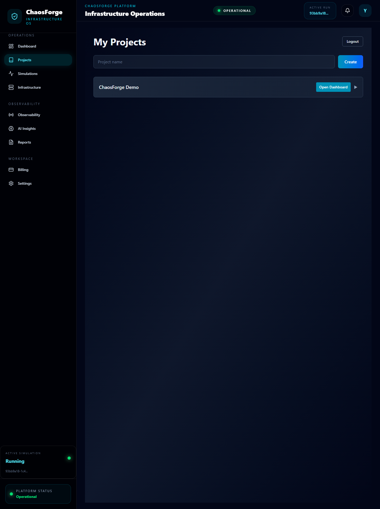
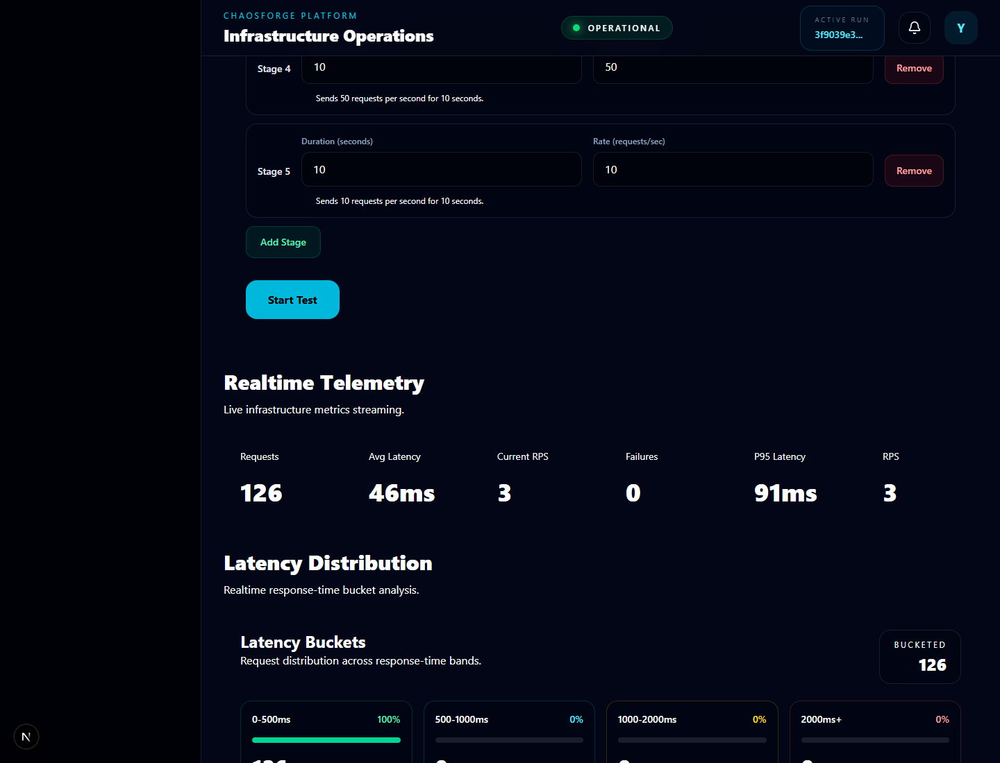
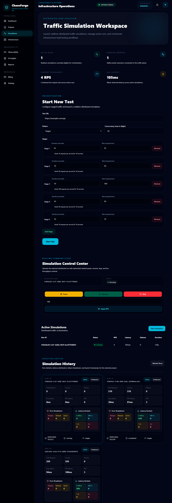
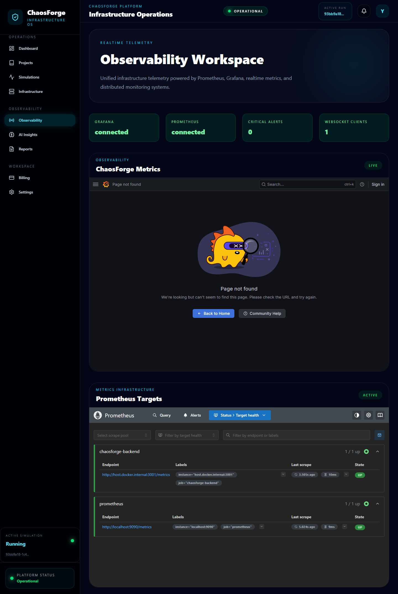
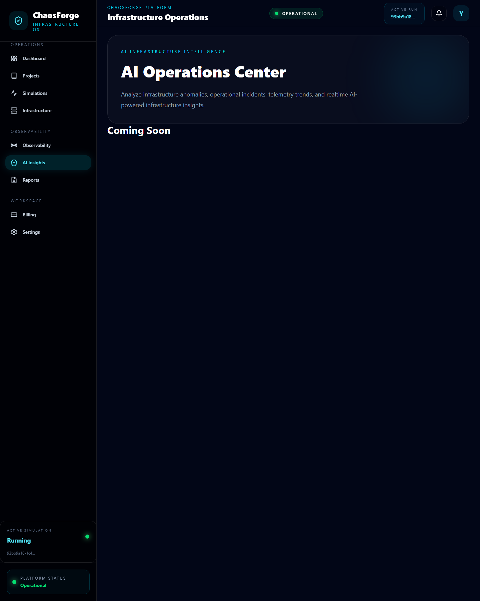
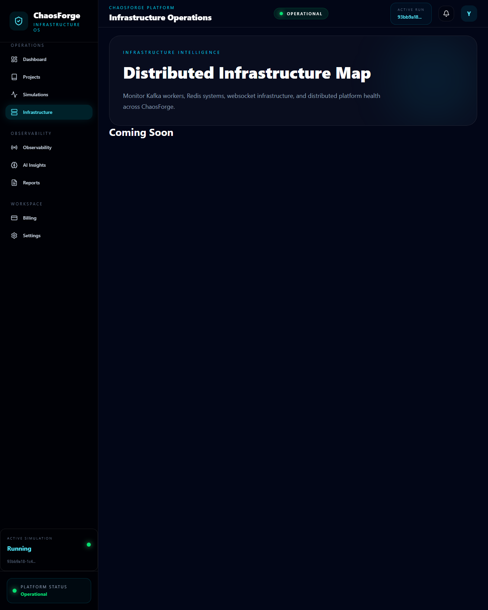
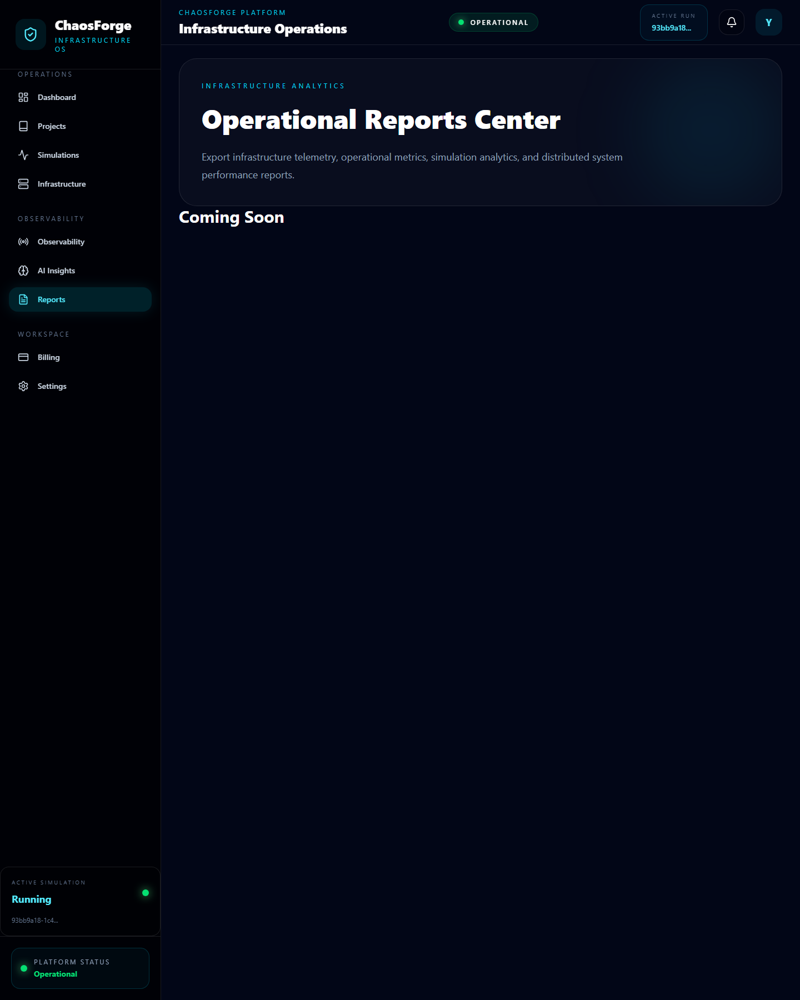

# ChaosForge

ChaosForge is a distributed load-testing and real-time workflow visualization platform for running staged traffic simulations against HTTP services. It is built around a control-plane model: users create projects, start simulations, watch live telemetry, inspect operational signals, and compare run behavior from a Next.js dashboard while the backend coordinates workers, metrics, and system state.

The project focuses on backend problems that usually stay hidden in simple load-testing demos: asynchronous request execution, worker coordination, low-latency metrics aggregation, failure classification, live logs, and observability. Instead of treating load testing as a single API loop, ChaosForge separates orchestration from execution so traffic generation, run control, and dashboard updates can evolve independently.

ChaosForge was built to practice production-style distributed workflow design at a realistic portfolio scale. The goal is not to claim massive scale, but to show practical engineering judgment around Kafka, Redis, WebSockets, Prometheus, Grafana, Docker, and a frontend that reflects live system behavior.

## Architecture Overview

ChaosForge is organized around a Next.js frontend, a Node.js/Express API gateway, Kafka-backed workers, Redis runtime state, MongoDB persistence, WebSocket streaming, and a Prometheus/Grafana monitoring layer.

The frontend acts as the control surface. Operators use it to manage projects, launch simulations, select active runs, view telemetry, inspect incidents, and open observability panels. It communicates with the backend through REST APIs for commands and WebSockets for live updates.

The backend owns authentication, project ownership, simulation orchestration, metrics aggregation, incident generation, AI analysis hooks, and WebSocket fanout. When a simulation starts, the API creates a run record, initializes runtime control state, publishes work through Kafka, and streams run updates back to the browser.

Kafka provides the event pipeline between orchestration and execution. The API publishes traffic work, while workers consume jobs independently and execute HTTP requests against the configured target. This keeps request execution outside the API process and makes worker count a deployment concern instead of a frontend concern.

Redis stores fast-moving runtime data: active run state, metrics counters, latency samples, log queues, pause/resume controls, stop signals, and WebSocket buffering. MongoDB remains the durable store for users, projects, and completed run summaries.

Prometheus scrapes backend metrics from `/metrics`, while Grafana provides operational dashboards. WebSockets handle short-loop dashboard updates, and Prometheus/Grafana handle longer-lived infrastructure visibility.

```text
┌──────────────────────────────────────────────────────────────┐
│                        CHAOSFORGE                            │
│             AI-Native Infrastructure Platform                │
└──────────────────────────────────────────────────────────────┘

                         ┌─────────────────┐
                         │     USERS       │
                         │  Operators/SRE  │
                         └────────┬────────┘
                                  │
                                  ▼

┌──────────────────────────────────────────────────────────────┐
│                    NEXT.JS FRONTEND                          │
│                                                              │
│  Dashboard      Simulations      Observability               │
│  AI Workspace   Projects         Infrastructure              │
│                                                              │
│  Realtime UI + WebSockets + Telemetry + AI Insights          │
└─────────────────────────┬────────────────────────────────────┘
                          │
                          ▼

┌──────────────────────────────────────────────────────────────┐
│                    API GATEWAY (NODE.JS)                     │
│                                                              │
│  Express API                                                 │
│  Auth Middleware                                             │
│  Run Orchestration                                           │
│  Metrics Aggregation                                         │
│  Incident Engine                                             │
│  AI Analysis Engine                                          │
│  WebSocket Server                                            │
└───────────────┬───────────────────────┬──────────────────────┘
                │                       │
                ▼                       ▼

┌──────────────────────┐     ┌──────────────────────────┐
│      REDIS           │     │         KAFKA            │
│                      │     │                          │
│  Run State Cache     │     │  Distributed Messaging   │
│  Queue Buffering     │     │  Worker Coordination     │
│  WebSocket Queue     │     │  Event Streaming         │
└──────────┬───────────┘     └────────────┬─────────────┘
           │                              │
           ▼                              ▼

┌──────────────────────────────────────────────────────────────┐
│                DISTRIBUTED WORKER CLUSTER                    │
│                                                              │
│  Load Generation Workers                                     │
│  Traffic Executors                                           │
│  HTTP Request Engines                                        │
│  Realtime Metrics Streaming                                  │
│  Failure Detection                                           │
└─────────────────────────┬────────────────────────────────────┘
                          │
                          ▼

┌──────────────────────────────────────────────────────────────┐
│                    OBSERVABILITY LAYER                       │
│                                                              │
│  Prometheus -> Metrics Collection                            │
│  Grafana    -> Dashboards & Visualization                    │
│  WebSockets -> Live Telemetry Streaming                      │
│                                                              │
│  CPU / RPS / Latency / Failures / Workers / Infra State      │
└─────────────────────────┬────────────────────────────────────┘
                          │
                          ▼

┌──────────────────────────────────────────────────────────────┐
│                     AI INTELLIGENCE LAYER                    │
│                                                              │
│  Infrastructure Analysis Engine                              │
│  Latency Spike Detection                                     │
│  Failure Pattern Analysis                                    │
│  Incident Correlation                                        │
│  Operational Recommendations                                 │
│  Future Autonomous Infrastructure Systems                    │
└──────────────────────────────────────────────────────────────┘
```

## Frontend Domain Architecture

```text
Dashboard
│
├── Platform Health
├── Infrastructure Status
├── AI Alerts
├── Incident Timeline
└── Realtime Telemetry

Simulations
│
├── Create Simulation
├── Run Controls
├── Active Simulations
├── Run History
├── Run Comparison
└── Traffic Orchestration

Projects
│
├── Project Management
├── Environment Targets
├── Project Analytics
├── Recent Runs
└── Linked Infrastructure

Observability
│
├── Grafana Workspace
├── Prometheus Targets
├── Metrics Monitoring
└── Telemetry Systems

AI Workspace
│
├── Operational Intelligence
├── Infrastructure Analysis
├── Failure Detection
├── AI Recommendations
└── Future Autonomous Systems
```

## Realtime Data Flow

```text
Workers
   │
   ▼
Kafka Topics
   │
   ▼
Node.js API Gateway
   │
   ├── Redis Cache
   ├── AI Analysis Engine
   ├── Incident Engine
   └── WebSocket Events
   │
   ▼
Frontend Realtime UI
   │
   ▼
Operators / SRE Teams
```

## System Design

Kafka is used to decouple simulation scheduling from request execution. The API decides what work should happen and when, but workers are responsible for actually executing traffic. This prevents the API process from becoming the only place where load generation happens and makes it possible to add more workers without changing the frontend contract.

Redis is used for low-latency coordination data. Run state, active controls, metrics counters, bounded latency samples, and live log buffers are short-lived and frequently updated, which makes Redis a better fit than writing every event directly to MongoDB. MongoDB is reserved for durable entities such as users, projects, and completed run summaries.

Concurrency is handled at the worker/request execution layer. A simulation can define request rate, staged traffic, and concurrency limits. Workers process messages asynchronously and update metrics as requests complete. This keeps long-running or slow target requests from blocking dashboard command handling.

Retry handling exists around HTTP request execution. Transient network failures and timeouts can be retried with backoff, while final failures are classified into useful categories such as timeout, server error, or network failure. This makes the dashboard more useful than a basic success/failure counter.

Metrics aggregation happens in two layers. Redis stores live counters and recent samples for dashboard responsiveness. Prometheus scrapes application-level metrics for operational monitoring and Grafana visualization. This separates user-facing realtime telemetry from infrastructure-level observability.

WebSocket updates are scoped to active runs and project context. Instead of forcing the frontend to poll constantly, the backend emits live metrics, logs, completion events, and incident updates. Log events can be buffered before emission to reduce unnecessary WebSocket noise during active simulations.

Deployment is Docker-oriented. The local stack includes frontend, backend, worker, Kafka, Redis, MongoDB, Prometheus, and Grafana. The services can also be run in a hybrid development mode where infrastructure runs in Docker and Node processes run on the host.

Scaling mainly depends on worker count, Kafka topic partitions, Redis write pressure, and the target service being tested. The current design supports manual worker scaling; future versions could use topic lag, request latency, and worker heartbeat metrics to guide autoscaling.

Known bottlenecks include Kafka startup readiness, worker availability before accepting a run, Redis pressure during high-frequency metrics writes, and WebSocket fanout if many clients watch the same run. The implementation reduces some of this pressure through bounded samples, batched log emission, TTL-based runtime keys, and aggregate metrics instead of unbounded raw event storage.

## Engineering Decisions & Tradeoffs

Kafka adds setup complexity, but it makes the worker boundary explicit. For this project, that tradeoff is useful because request execution should not live entirely inside the API process. The cost is local development complexity: Kafka readiness, topic configuration, worker startup, and failure handling need careful treatment.

Redis keeps live dashboard reads fast, but it is intentionally ephemeral. This is acceptable for active run state and recent telemetry, but it means completed runs need to be reconciled back into MongoDB if they should remain available after Redis data expires.

MongoDB is used for durable application data rather than high-volume request telemetry. Storing every request sample in MongoDB would make historical analysis easier, but it would also turn MongoDB into a telemetry sink. ChaosForge stores summarized run data and bounded samples instead.

WebSockets provide a better operator experience than polling, but they introduce fanout and lifecycle concerns. The backend needs to scope events carefully, handle disconnects, and avoid emitting one event per internal operation when traffic volume increases.

Prometheus and Grafana are included because load-testing systems need observability of the tester itself, not only the target service. The monitoring layer helps answer whether a failed run came from the target, the workers, Kafka, Redis, or the API.

The current system favors understandable distributed behavior over aggressive optimization. That means some advanced features are intentionally left for future work: dead-letter queues, worker autoscaling, dashboard provisioning, stronger backpressure controls, richer historical traces, and integration tests that bring up the full dependency stack.

## Features

- Kafka-backed asynchronous worker orchestration for distributed traffic execution.
- Redis-based runtime state for active runs, live metrics, control flags, and log buffering.
- WebSocket-driven realtime dashboard updates for metrics, logs, incidents, and run completion.
- Staged load simulation configuration with request rate and concurrency controls.
- Distributed HTTP request execution through worker processes.
- Failure classification for timeout, server-side, and network-level errors.
- Per-run metrics including request count, failures, latency buckets, average latency, p95 latency, and current RPS.
- Project-scoped run history and run comparison workflows.
- Prometheus `/metrics` endpoint for backend and simulation-level instrumentation.
- Grafana and Prometheus integration for observability workflows.
- Infrastructure dashboard sections for health, topology, alerts, telemetry, and incident timelines.
- AI analysis workspace hooks for operational insight and failure-pattern analysis.

## Tech Stack

Backend:

- Node.js
- Express
- Socket.IO
- JWT authentication
- Worker processes
- Winston logging

Frontend:

- Next.js
- React
- Recharts
- Tailwind CSS
- WebSocket client integration

Messaging:

- Apache Kafka
- KafkaJS
- Topic-based worker coordination

Databases:

- MongoDB with Mongoose
- Redis for live state and metrics coordination

Monitoring:

- Prometheus
- Grafana
- `prom-client`
- Health and readiness endpoints

DevOps:

- Docker
- Docker Compose
- Service-level environment configuration
- Local infrastructure profiles

Deployment:

- Docker Compose for local full-stack deployment
- Host-based development mode for frontend/backend
- Environment-driven service URLs

Testing:

- Manual integration testing through the dashboard and API
- Socket connectivity test script
- Future work: automated integration tests with Redis, Kafka, MongoDB, and worker processes

## Production-Oriented Improvements

ChaosForge includes several implementation choices that move it beyond a simple CRUD portfolio project:

- Backend request IDs for traceability.
- Worker readiness checks before accepting Kafka-backed simulations.
- Redis-backed pause, resume, stop, and rate-control state.
- Bounded latency and timestamp samples to avoid unbounded memory growth.
- TTL-based runtime keys for temporary run data.
- Retry handling for transient HTTP failures.
- Failure classification for more useful run summaries.
- Buffered WebSocket log emission to reduce event noise.
- Prometheus metrics for API, WebSocket, simulation, failure, and latency signals.
- Grafana dashboards for operational visibility.
- Docker Compose topology for local infrastructure parity.
- Environment-based CORS and service URL configuration.
- Rate limiting dependency available for public API hardening.
- Separation between infrastructure services and app services.

Areas that would be improved before treating this as a production service:

- Add dead-letter handling for malformed Kafka messages.
- Add idempotency keys around simulation start requests.
- Add stronger backpressure when Kafka lag or Redis write pressure increases.
- Add worker autoscaling signals based on topic lag and worker heartbeat state.
- Persist richer run traces outside Redis for deeper post-run analysis.
- Add Grafana dashboard provisioning as versioned JSON.
- Add CI checks for linting, builds, Docker image validation, and smoke tests.
- Add integration tests that start Kafka, Redis, MongoDB, backend, and workers together.

## Screenshots & Visual Documentation

Place all README visuals under `docs/images/` and demo media under `docs/demo/`.

Architecture diagram:


API and worker flow:


Home page:


Projects page:



Dashboard with a running simulation:


This capture includes the dashboard running state with platform health, infrastructure status, run selection, realtime telemetry, latency distribution, active simulations, live infrastructure feed, topology, alerts, and incident timeline.

Realtime metrics panels:



Simulations page with active run controls:



Observability page with Grafana and Prometheus available:



Grafana dashboard:


Prometheus targets and query panels:


AI workspace:



Infrastructure page:



Reports page:



Optional demo walkthrough media can be placed at:

```text
docs/demo/chaosforge-demo.gif
docs/demo/chaosforge-demo.mp4
```

Suggested demo account for documentation captures:

```text
Email: aman@gmail.com
Password: 123456
```

## Local Setup

Prerequisites:

- Node.js 20+
- Docker Desktop
- npm
- Git

Install dependencies:

```bash
cd backend
npm install

cd ../frontend
npm install
```

Create `backend/.env`:

```env
NODE_ENV=development
PORT=3001
JWT_SECRET=replace-with-a-local-secret

FRONTEND_URL=http://localhost:3000
CORS_ORIGIN=http://localhost:3000

MONGO_URI=mongodb://localhost:27017/chaosforge
REDIS_URL=redis://localhost:6379

USE_KAFKA=true
KAFKA_BROKER=localhost:29092
KAFKA_TOPIC_REPLICATION_FACTOR=1
KAFKA_TRAFFIC_TOPIC_PARTITIONS=6

PROMETHEUS_BASE_URL=http://localhost:9090
PROMETHEUS_HEALTH_URL=http://localhost:9090/-/healthy

GRAFANA_URL=http://localhost:5000
GRAFANA_WAKE_URL=http://localhost:5000
GRAFANA_HEALTH_URL=http://localhost:5000/api/health
```

Create `frontend/.env.local`:

```env
NEXT_PUBLIC_API_URL=http://localhost:3001
NEXT_PUBLIC_SOCKET_URL=http://localhost:3001
NEXT_PUBLIC_GRAFANA_URL=http://localhost:5000
NEXT_PUBLIC_GRAFANA_WAKE_URL=http://localhost:5000
NEXT_PUBLIC_PROMETHEUS_URL=http://localhost:9090
```

## Docker Setup

Start infrastructure services:

```bash
docker compose up -d redis kafka mongo prometheus grafana
```

Start the full stack through Docker Compose:

```bash
docker compose --profile app up --build
```

Useful local reset:

```bash
docker compose down
docker compose up -d redis kafka mongo prometheus grafana
```

Use volume deletion only when intentionally clearing local data:

```bash
docker compose down -v
```

## Kafka Setup

For local host-based backend development, Kafka should be reachable at:

```text
localhost:29092
```

For backend and workers running inside Docker Compose, use:

```text
kafka:9092
```

Recommended local values:

```env
USE_KAFKA=true
KAFKA_BROKER=localhost:29092
KAFKA_TRAFFIC_TOPIC_PARTITIONS=6
KAFKA_TOPIC_REPLICATION_FACTOR=1
```

Give Kafka a short startup window before launching a simulation. Worker readiness depends on the broker being reachable and the traffic topic being available.

## Redis Setup

Redis is used for runtime coordination and should be reachable locally at:

```text
redis://localhost:6379
```

The application uses Redis for:

- Active run state
- Metrics counters
- Latency samples
- Log queues
- Pause/resume/stop controls
- WebSocket buffering

## Monitoring Setup

Prometheus:

```text
http://localhost:9090
```

Grafana:

```text
http://localhost:5000
```

Backend metrics endpoint:

```text
http://localhost:3001/metrics
```

Prometheus should scrape the backend. When Prometheus runs in Docker and the backend runs on the host, the scrape target may need to use:

```text
host.docker.internal:3001
```

## Running Locally

Start the backend API:

```bash
cd backend
npm run dev:server
```

Start a worker:

```bash
cd backend
npm run dev:worker
```

Start the frontend:

```bash
cd frontend
npm run dev
```

Open:

- Frontend: `http://localhost:3000`
- Backend health: `http://localhost:3001/health`
- Backend metrics: `http://localhost:3001/metrics`
- Prometheus: `http://localhost:9090`
- Grafana: `http://localhost:5000`

## Running a Simulation

1. Sign in or create an account.
2. Create a project from the Projects page.
3. Open the dashboard or simulations page.
4. Configure a staged simulation with target URL, duration, rate, and concurrency.
5. Start the run.
6. Watch realtime telemetry, latency buckets, active simulation state, logs, incidents, and observability panels.

For local smoke testing, use a target you control, such as:

```text
http://localhost:3001/health
```

Avoid pointing high-rate simulations at third-party services without permission.

## Future Evolution Roadmap

```text
PHASE 1
Realtime Distributed Load Testing
        │
        ▼

PHASE 2
Observability + AI Intelligence
        │
        ▼

PHASE 3
Distributed Infrastructure Intelligence
        │
        ▼

PHASE 4
Autonomous Infrastructure Operations
        │
        ▼

PHASE 5
AI-Native Infrastructure Operating System
```

## Troubleshooting

Kafka worker is not ready:

- Confirm Kafka is listening on `localhost:29092`.
- Confirm `USE_KAFKA=true` for the API and workers.
- Start at least one worker before launching a run.
- Give Kafka time to finish startup after Docker begins running.

Frontend cannot reach backend:

- Confirm `NEXT_PUBLIC_API_URL=http://localhost:3001`.
- Confirm `http://localhost:3001/health` responds.
- Check `FRONTEND_URL` and `CORS_ORIGIN` in the backend environment.

No realtime metrics:

- Confirm Redis is running.
- Confirm a project and run are selected.
- Confirm the worker is running and consuming traffic messages.
- Check whether the target URL is reachable from the worker process.

Prometheus or Grafana disconnected:

- Confirm both containers are running with `docker compose ps`.
- Open `http://localhost:9090/-/healthy`.
- Open `http://localhost:5000/api/health`.
- Confirm Prometheus is scraping the correct backend host and port.

Simulations finish too quickly to capture:

- Increase stage duration.
- Lower request rate for easier visual inspection.
- Keep the dashboard, simulations page, and observability page open while the run is active.

## Current Limitations

- Grafana dashboards are not yet provisioned as versioned JSON files.
- Automated test coverage is limited.
- Kafka dead-letter handling is not implemented yet.
- Redis stores bounded live samples, not full historical traces.
- Worker autoscaling is manual.
- AI analysis is currently an application-level insight layer, not an autonomous control system.

These limitations are intentional next steps. The current implementation prioritizes a clear distributed execution model, live telemetry, and operational visibility over pretending to be a fully managed production platform.
